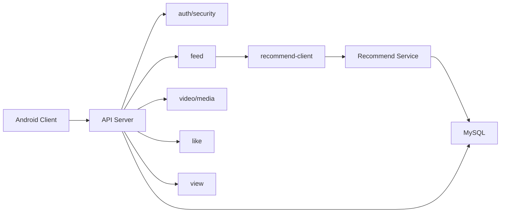

# Backend Module Plan

## 1. 总体结构

后端只规划两个服务：

| 服务 | 模块 | 职责 |
| --- | --- | --- |
| API Server | HTTP REST API | 面向 Android 客户端 |
| Recommend Service | RPC | 面向 API Server，提供推荐视频 ID |

不规划收藏、关注、分享、消息、搜索等非课程必需模块；这些可在 Bonus 阶段增加。

## 2. API Server 模块

| 模块 | 职责 | 对应接口 |
| --- | --- | --- |
| `auth` | 注册、登录、退出、token 签发/校验、密码哈希 | `POST /auth/register`、`POST /auth/login`、`POST /auth/logout` |
| `user` | 当前用户资料 | `GET /me` |
| `video` | 发布视频、我的视频分页、删除视频、视频详情拼装 | `POST /videos`、`GET /me/videos`、`DELETE /videos/{videoId}` |
| `media` | 上传凭证、视频/封面存储元数据 | `POST /media-upload-tokens` |
| `like` | 点赞、取消点赞、计数一致性 | `PUT /videos/{videoId}/likes/me`、`DELETE /videos/{videoId}/likes/me` |
| `view` | 记录访问过的视频 | `POST /videos/{videoId}/views/me` |
| `feed` | 推荐流 REST 入口，调用 RPC 后补详情 | `GET /feeds/recommended/videos` |
| `recommend-client` | RPC 客户端封装 | 被 `feed` 模块调用 |
| `logging` | 统一 requestId、输入/输出/耗时日志 | 所有 REST 接口 |
| `security` | 鉴权中间件、权限校验、敏感字段脱敏 | 所有需登录接口 |
| `monitoring` | 健康检查、基础指标 | `GET /health`，可选 `GET /metrics` |

## 3. Recommend Service 模块

| 模块 | 职责 | 对应 RPC |
| --- | --- | --- |
| `recommend-api` | RPC 契约定义 | `ListRecommendedVideos` |
| `recommend-core` | 推荐规则：按点赞数降序，过滤访问记录 | `ListRecommendedVideos` |
| `recommend-repository` | 查询 videos、video_views | `ListRecommendedVideos` |
| `recommend-logging` | RPC requestId、耗时、异常日志 | 全部 RPC |

## 4. 模块依赖

## 5. 接口到模块映射

| 接口 | API Server 模块 | 数据表 | RPC |
| --- | --- | --- | --- |
| `POST /auth/register` | `auth` | `users` | 无 |
| `POST /auth/login` | `auth` | `users`、可选 `auth_tokens` | 无 |
| `POST /auth/logout` | `auth` | 可选 `auth_tokens` | 无 |
| `GET /me` | `user` | `users`、`videos` | 无 |
| `GET /feeds/recommended/videos` | `feed`、`recommend-client` | `videos`、`video_likes`、`video_views` | `RecommendService.ListRecommendedVideos` |
| `POST /videos/{videoId}/views/me` | `view` | `video_views`、`videos` | 无 |
| `PUT /videos/{videoId}/likes/me` | `like` | `video_likes`、`videos` | 无 |
| `DELETE /videos/{videoId}/likes/me` | `like` | `video_likes`、`videos` | 无 |
| `POST /media-upload-tokens` | `media` | `upload_objects` | 无 |
| `POST /videos` | `video` | `videos`、`upload_objects` | 无 |
| `GET /me/videos` | `video` | `videos` | 无 |
| `DELETE /videos/{videoId}` | `video`、`security` | `videos` | 无 |
| `GET /health` | `monitoring` | 可检查 DB/RPC | 可选 ping RPC |

## 6. 权限规则

| 操作 | 权限 |
| --- | --- |
| 推荐流 | 必须登录，用当前用户过滤访问记录 |
| 记录访问 | 必须登录，只能为当前用户写 `video_views` |
| 点赞 | 必须登录，只能为当前用户写 `video_likes` |
| 发布视频 | 必须登录，作者固定为当前用户 |
| 我的列表 | 必须登录，只查询当前用户视频 |
| 删除视频 | 必须登录，且 `videos.author_id == currentUser.id` |
| 上传凭证 | 必须登录，上传对象归属当前用户 |

## 7. Bonus 模块

| 模块 | 接口 | 状态 |
| --- | --- | --- |
| `comment` | `GET/POST /videos/{videoId}/comments` | Bonus |
| `favorite` | `/favorites/me` | 暂不做 |
| `follow` | `/following/users` | 暂不做 |
| `share` | `/shares` | 暂不做 |
| `message` | `/message-overview` | 暂不做 |
| `search` | `/videos?q=` | 暂不做 |
