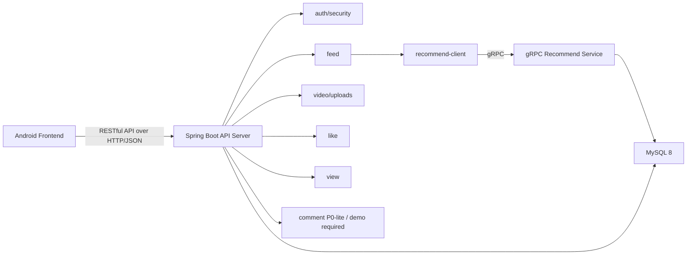

# Backend Module Plan

## 1. 总体结构

固定架构：

```text
Android Frontend -> RESTful API over HTTP/JSON -> Spring Boot API Server -> gRPC Recommend Service -> MySQL 8
```

后端只规划两个运行单元：

| 服务 | 技术 | 职责 |
| --- | --- | --- |
| Spring Boot API Server | Java 17 + Spring Boot + Maven | 面向 Android 客户端提供 RESTful HTTP/JSON API |
| gRPC Recommend Service | Java 17 + gRPC + Maven | 面向 API Server 提供推荐 videoIds |

API Server 和 Recommend Service 都可以访问 MySQL 8。视频文件由 API Server 保存到本地 `uploads/` 目录。

收藏、关注、分享、消息、搜索等非课程必需功能只作为 Bonus。

## 2. Spring Boot API Server 模块

| 模块 | 职责 | 对应接口 |
| --- | --- | --- |
| `auth` | 注册、登录、退出、token 签发/校验、密码哈希 | `POST /auth/register`、`POST /auth/login`、`POST /auth/logout` |
| `user` | 当前用户资料 | `GET /me` |
| `video` | multipart 上传到 `uploads/`、发布视频、我的视频分页、删除视频、视频详情拼装 | `POST /videos`、`GET /me/videos`、`DELETE /videos/{videoId}` |
| `like` | 点赞、取消点赞、计数一致性 | `PUT /videos/{videoId}/likes/me`、`DELETE /videos/{videoId}/likes/me` |
| `view` | 记录访问过的视频 | `POST /videos/{videoId}/views/me` |
| `feed` | 推荐流 REST 入口，调用 gRPC 后补详情；重置当前用户推荐过滤历史 | `GET /feeds/recommended/videos`、`POST /feeds/recommended/reset`、`POST /feeds/recommended/videos/{videoId}/reset` |
| `recommend-client` | gRPC 客户端封装 | 被 `feed` 模块调用 |
| `comment` | P0-lite、最终演示必做的评论列表和发表评论 | `GET/POST /videos/{videoId}/comments` |
| `logging` | 统一 requestId、输入/输出/耗时日志 | 所有 REST 接口 |
| `security` | 鉴权中间件、权限校验、敏感字段脱敏 | 所有需登录接口 |
| `monitoring` | 健康检查 | `GET /health` |

不作为 P0 的 API Server 模块：

| 模块 | 状态 |
| --- | --- |
| `media-upload-token` | Bonus；P0 不做 `POST /media-upload-tokens` |
| `metrics` | Bonus / 不做 |
| `favorite`、`follow`、`share`、`message`、`search` | Bonus |

## 3. gRPC Recommend Service 模块

| 模块 | 职责 | 对应 RPC |
| --- | --- | --- |
| `recommend-api` | gRPC proto / 契约定义 | `RecommendService.ListRecommendedVideos` |
| `recommend-core` | 推荐规则：按点赞数降序，过滤访问记录；重置当前用户访问过滤记录 | `ListRecommendedVideos`、`ResetRecommendedHistory`、`ResetRecommendedVideoHistory` |
| `recommend-repository` | 查询 `videos`、`video_views`，按用户或按用户+视频删除 `video_views` | `ListRecommendedVideos`、`ResetRecommendedHistory`、`ResetRecommendedVideoHistory` |
| `recommend-logging` | gRPC requestId、耗时、异常日志 | 全部 gRPC |

## 4. 模块依赖



## 5. 接口到模块映射

| 接口 | API Server 模块 | 数据表 | gRPC |
| --- | --- | --- | --- |
| `POST /auth/register` | `auth` | `users` | 无 |
| `POST /auth/login` | `auth` | `users` | 无 |
| `POST /auth/logout` | `auth` | 无；客户端删除 token | 无 |
| `GET /me` | `user` | `users`、`videos` | 无 |
| `GET /feeds/recommended/videos` | `feed`、`recommend-client` | `videos`、`video_likes`、`video_views` | `RecommendService.ListRecommendedVideos` |
| `POST /feeds/recommended/reset` | `feed`、`recommend-client` | `video_views` | `RecommendService.ResetRecommendedHistory` |
| `POST /feeds/recommended/videos/{videoId}/reset` | `feed`、`recommend-client` | `video_views` | `RecommendService.ResetRecommendedVideoHistory` |
| `POST /videos/{videoId}/views/me` | `view` | `video_views`、`videos` | 无 |
| `PUT /videos/{videoId}/likes/me` | `like` | `video_likes`、`videos` | 无 |
| `DELETE /videos/{videoId}/likes/me` | `like` | `video_likes`、`videos` | 无 |
| `POST /videos` | `video` | `videos` | 无 |
| `GET /me/videos` | `video` | `videos` | 无 |
| `DELETE /videos/{videoId}` | `video`、`security` | `videos` | 无 |
| `GET /videos/{videoId}/comments` | `comment` | `comments`、`videos` | 无 |
| `POST /videos/{videoId}/comments` | `comment` | `comments`、`videos` | 无 |
| `GET /health` | `monitoring` | 可检查 MySQL/gRPC | 可 ping 推荐服务 |

## 6. 权限规则

| 操作 | 权限 |
| --- | --- |
| 推荐流 | 必须登录，用当前用户过滤访问记录 |
| 重置推荐历史 | 必须登录，只删除当前用户的 `video_views` |
| 重置单视频推荐历史 | 必须登录，只删除当前用户与指定视频的 `video_views` |
| 记录访问 | 必须登录，只能为当前用户写 `video_views` |
| 点赞 | 必须登录，只能为当前用户写 `video_likes` |
| 发布视频 | 必须登录，作者固定为当前用户 |
| 我的列表 | 必须登录，只查询当前用户视频 |
| 删除视频 | 必须登录，且 `videos.author_id == currentUser.id`；重复删除返回 200 |
| 评论列表 | 必须登录 |
| 发表评论 | 必须登录，作者固定为当前用户 |

## 7. 实现顺序原则

先实现核心 P0：账号、日志、发布、我的视频、删除、点赞、访问记录、gRPC 推荐、推荐流、健康检查。

再实现 P0-lite：评论列表和发表评论。P0-lite 只表示顺序后置，必须在前端最终联调和演示前完成。

最后再考虑 Bonus：上传凭证、收藏、关注、分享、消息、搜索、metrics。

## 8. Android 前端联调边界

| 前端能力 | 当前状态 | 后续必做接入 |
| --- | --- | --- |
| 上下滑播放 | Android Compose Demo 已具备 | 推荐列表改为真实 REST 数据，保持查看上一个/下一个视频 |
| 登录态 | 当前缺真实账号接口 | 接入注册、登录、退出、`GET /me` 和 Bearer token |
| 推荐与浏览 | 当前为本地 mock | 接入推荐流；视频开始展示时调用访问记录接口 |
| 点赞 | 当前为本地状态 | 接入点赞/取消点赞并使用服务端计数 |
| 发布与我的视频 | 当前为本地 Demo | 接入 multipart 发布、我的视频分页、删除权限 |
| 评论 | 当前有本地弹层 | 接入评论列表和发表评论，纳入最终演示闭环 |
| 收藏、关注、分享、消息、搜索 | 已有部分本地界面 | 不作为主线，不得挤占课程评分点开发时间 |
