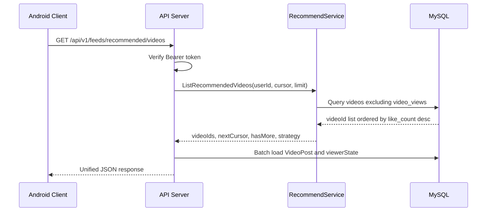

# RPC Design

## 1. 架构边界

不引入复杂微服务，只保留两个后端运行单元：

| 组件 | 类型 | 职责 |
| --- | --- | --- |
| API Server | REST 服务 | 鉴权、参数校验、统一响应、日志、视频详情查询、发布/点赞/删除等业务接口 |
| Recommend Service | RPC 服务 | 根据课程规则生成推荐 videoId 列表 |

Android 客户端只访问 API Server 的 REST 接口；API Server 在 `GET /api/v1/feeds/recommended/videos` 内部通过 RPC 调用 Recommend Service。

## 2. 调用链

## 3. RecommendService

服务名：`RecommendService`

方法：`ListRecommendedVideos`

### Request

| 字段 | 类型 | 必填 | 说明 |
| --- | --- | --- | --- |
| `requestId` | string | 是 | API Server 传入，用于日志串联 |
| `userId` | int64 | 是 | 当前登录用户 ID |
| `cursor` | string | 否 | 推荐分页游标 |
| `limit` | int32 | 是 | 返回数量，最大 30 |
| `excludeViewed` | bool | 是 | P0 固定为 true |
| `strategy` | string | 否 | P0 固定 `like_count_desc` |

### Response

| 字段 | 类型 | 必填 | 说明 |
| --- | --- | --- | --- |
| `videoIds` | list<int64> | 是 | 推荐视频 ID 列表 |
| `nextCursor` | string | 否 | 下一页游标 |
| `hasMore` | bool | 是 | 是否还有更多 |
| `strategy` | string | 是 | 实际策略，固定 `like_count_desc_exclude_viewed` |
| `debugMessage` | string | 否 | 仅开发环境可返回 |

## 4. 推荐规则

P0 推荐规则必须简单、确定、可测试：

| 步骤 | 规则 |
| --- | --- |
| 1 | 只推荐 `videos.status='published'` 的视频 |
| 2 | 只推荐 `videos.visibility='public'` 的视频 |
| 3 | 排除 `videos.deleted_at IS NOT NULL` 的视频 |
| 4 | 排除当前用户在 `video_views` 表中已访问的视频 |
| 5 | 按 `like_count DESC` 排序 |
| 6 | 点赞数相同按 `created_at DESC, id DESC` 排序 |

推荐游标建议编码以下字段：

| 字段 | 用途 |
| --- | --- |
| `lastLikeCount` | 下一页继续按点赞数分页 |
| `lastCreatedAt` | 点赞相同时稳定排序 |
| `lastVideoId` | 避免重复和漏数据 |

## 5. SQL 设计思路

Recommend Service 查询 MySQL，返回 ID 列表，不负责拼完整视频详情。

逻辑表达：

| 条件 | 说明 |
| --- | --- |
| `v.status = 'published'` | 只推荐已发布视频 |
| `v.visibility = 'public'` | 私密视频不推荐 |
| `v.deleted_at IS NULL` | 已删除视频不推荐 |
| `NOT EXISTS video_views(user_id, video_id)` | 访问过不再推荐 |
| `ORDER BY v.like_count DESC, v.created_at DESC, v.id DESC` | 课程指定按点赞数最高推荐 |

## 6. API Server 职责

| 职责 | 说明 |
| --- | --- |
| 鉴权 | REST 层先解析 token，得到 `currentUser.id` |
| 参数校验 | 校验 `cursor`、`limit` |
| RPC 调用 | 调 `RecommendService.ListRecommendedVideos` |
| 详情补全 | 根据 `videoIds` 批量查询 videos、authors、liked/viewed/owner 状态 |
| 顺序保持 | 返回列表顺序必须与 RPC 返回 `videoIds` 顺序一致 |
| 日志 | 记录 REST 输入/输出/耗时；RPC 耗时可写入扩展字段或日志 |
| 降级 | RPC 失败时返回 500，开发阶段不做复杂降级 |

## 7. 访问记录写入

访问记录不由 Recommend Service 写入。由 API Server 的 REST 接口负责：

| 接口 | 职责 |
| --- | --- |
| `POST /api/v1/videos/{videoId}/views/me` | 新建或更新当前用户访问记录 |

前端触发建议：

| 时机 | 建议 |
| --- | --- |
| 切换到某视频并开始播放 | P0 采用此时机，简单可验证 |
| 播放超过 1 秒 | 可选，更接近真实曝光 |
| 播放完成 | 不建议作为 P0，可能导致滑过但未完成的视频仍重复推荐 |

## 8. 异常处理

| 场景 | API Server 处理 |
| --- | --- |
| RPC 超时 | 返回 HTTP 500，业务码 `50001`，日志记录 `recommend_rpc_timeout` |
| RPC 返回空列表 | 返回空 `items`、`hasMore=false` |
| cursor 非法 | REST 层或 RPC 层返回 `40001` |
| 数据库无对应视频详情 | API Server 跳过缺失视频并记录警告；如果全部缺失返回空列表 |

## 9. 测试重点

| 测试 | 验收 |
| --- | --- |
| 排序测试 | 多条视频按 `like_count desc` 返回 |
| 过滤测试 | `video_views` 中已有记录的视频不返回 |
| 分页测试 | 第一页和第二页无重复 |
| RPC 调用测试 | REST 推荐接口必须经过 RecommendService |
| 异常测试 | RPC 不可用时 REST 返回 500 并有日志 |
